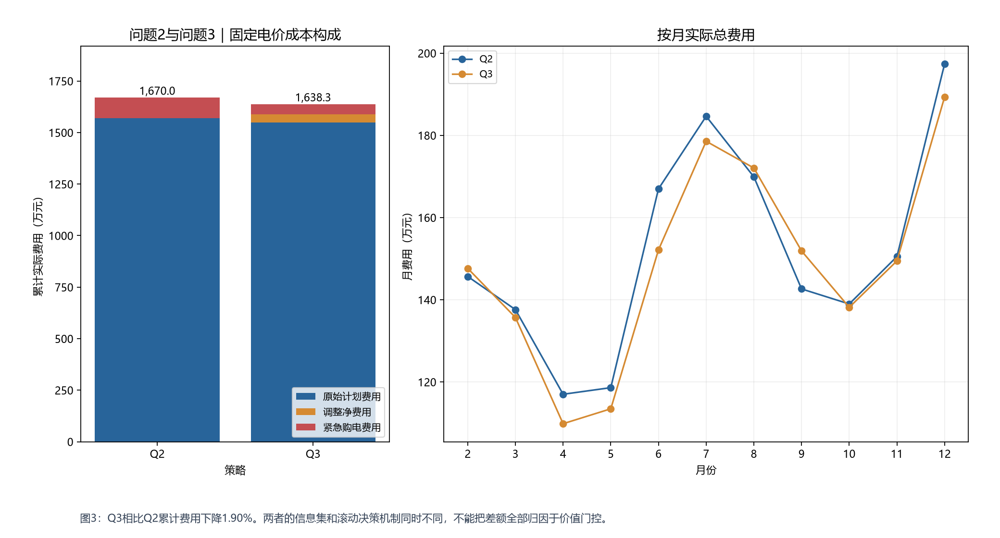
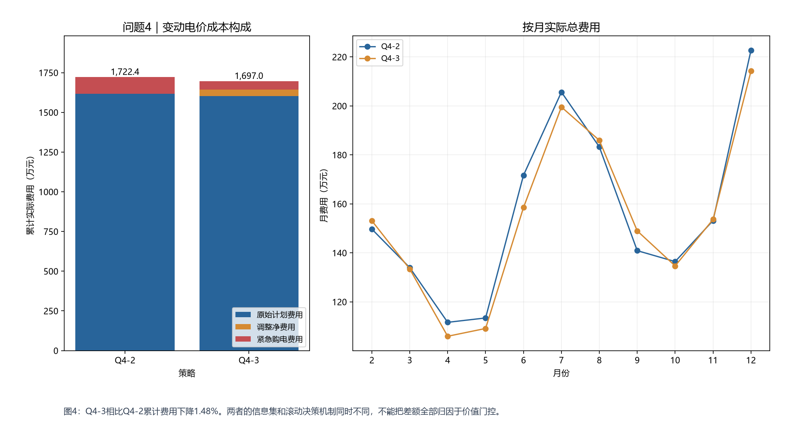
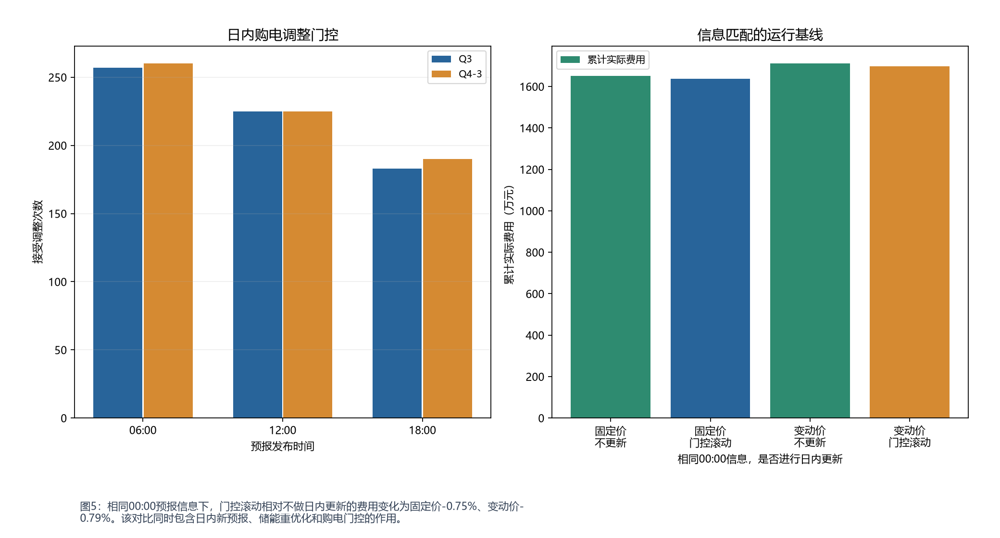

# C题：Python模型求解与结果说明（修正版）

本报告对应 `src/sxjm/solve_verified_models.py`。旧版 `outputs/model_solution` 为分位数加裕度的启发式基线，不能当作DRO/CVaR精确求解结果。修正版数值以本目录为准。

## 1. 求解范围及必须说明的假设

1. Q1按题给典型日确定性净负荷求解；Q2—Q4均逐日、逐发布时间回放，只允许历史实际值及当时已发布的预报进入决策。电量采用kWh/10分钟，功率约束用5000×1/6转换为每时段833.333 kWh。
2. 充、放电效率分别取0.9，往返效率为0.81；SOC范围1200—10800 kWh。若题意0.9指往返效率，则应改成两侧sqrt(0.9)后重算，不能混用。
3. 1月用于历史初始化，电池保持6000 kWh，购电计划采用前一天正净负荷，缺口紧急购买；1月1日无历史时q=0。记录见january_initialization.csv。2月1日继承1月31日实际末态，未凭空重置SOC；此初始化不是1月最优调度。
4. 主口径不售电，未使用的计划电仍需付款；调减退款系数rho由运行参数给出。调整费用按各时段最终计划相对原始计划计算，而非把反复调整作为独立交易累加。若题目要求逐次结算，必须换结算模型。
5. 本次第四问电价信息采用 **known**：known表示00:00已知当日各时段电价；unknown表示仅由历史预测价格。其余可调参数见solution_summary.json。

## 2. 数据输入 → 参数初始化 → 模型调用 → 结果输出

|步骤|对应Python位置|注意事项|
|---|---|---|
|数据输入|solve_all_models.load_inputs；causal_scenarios.CausalScenarioFactory|读取未标准化的物理量CSV；检查365×144及各发布时间的未来可用段；不使用processed_full缩放量。|
|参数初始化|model_config.ModelConfig；主程序命令行参数|效率在(0,1]；CVaR置信水平在(0,1)；rho、lambda在[0,1]；epsilon当前限制在[0,1]。|
|确定性模型|optimization.solve_energy_plan|Q1稀疏能量流LP；末态6000；检查功率、SOC、互斥残差。|
|随机模型|stochastic.solve_stochastic_plan|有限支持运输距离DRO+CVaR；先LP，若充放同时为正则启用二元变量重解MILP。|
|滚动调用|solve_verified_models.run_mode|06/12/18点只改未执行时段；候选模型直接包含调增、调减费用；门控不接受时仍允许储能在原购电计划下重优化。|
|结果输出|write_workbook；verify_mode；verify_workbook；verified_outputs|输出全时段CSV、全日期表格和图；独立重算收支、连续SOC、费用；原始数据与模板SHA-256前后校验一致。|

### 关键参数

- CVaR置信水平 alpha=0.8；风险权重 lambda=0.2；Wasserstein半径 epsilon=0.15；支持场景数上限=8。
- epsilon是对标准化整日轨迹距离的限制，不是预测误差百分比。lambda=0得到纯最坏期望；epsilon=0得到所选支持的经验分布风险模型。
- 紧急电价倍率5、调增倍率1.5、调减处罚倍率0.5、退款系数rho=0.0。门控经验自助法使用300次重采样和固定种子，阈值为保留方案情景平均总费用的0.1%。
- 参数应仅用考核日前的训练/验证窗口选择；本文参数是透明的预设值，不声称最优调参。名义90%历史校准带只用于诊断，不作为硬保供承诺。

## 3. 公式与代码对应

### 3.1 物理层

对每时段，q为付费计划，x为实际使用计划电，h为紧急购电，c/d为充/放电，s为弃光：

$$x_t+h_t+d_t-c_t-s_t=N_t,\qquad 0\le x_t\le q_t.$$

$$E_t=E_{t-1}+0.9c_t-d_t/0.9,\quad 1200\le E_t\le10800.$$

$$0\le c_t\le B y_t,\quad0\le d_t\le B(1-y_t),\quad B=5000/6,\quad y_t\in\{0,1\}.$$

优化使用公共c、d及E路径。情景紧急电量满足h_st≥N_st+c_t-d_t-q_t；同时限制d_t−c_t≤max(min_s N_st,0)，禁止用弃电吸收电池放电。这一额外保守限制让有限场景共同动作可行。执行时只根据当前实际净负荷和SOC裁剪储能动作，偏差量逐日记录，不读取未来实际值。

### 3.2 成本及DRO/CVaR

原始计划费用p·q0始终计入；滚动阶段令u=max(q−q0,0)、v=max(q0−q,0)：

$$C_s=\sum_t [p_{st}q_t^0+1.5p_{st}u_t+(0.5-\rho)p_{st}v_t+5p_{st}h_{st}].$$

日前阶段用p·q替代前三项。代码以q−u+v=q0及u,v≥0线性化；两侧费用斜率使同时调增调减没有收益。终端SOC计划目标统一6000 kWh，实际SOC不重置，下一次求解从实际状态开始。

支持情景概率为pi_j。运输矩阵gamma将经验质量搬到同一有限支持，满足sum_s gamma_js=pi_j、sum_js D_js gamma_js≤epsilon。目标为：

$$\min_a\ \sup_{P\in\mathcal P}\{\mathbb E_P[C(a)]+\lambda\operatorname{CVaR}_{\alpha,P}(C(a))\}.$$

CVaR引入zeta、xi_s≥C_s−zeta、xi_s≥0；运输线性规划对偶引入theta≥0和自由beta_j：

$$\min\ \lambda\zeta+\epsilon\theta+\sum_j\pi_j\beta_j,$$

$$\beta_j\ge C_s+\lambda\xi_s/(1-\alpha)-\theta D_{js},\quad\forall j,s.$$

有限概率单纯形上的凸紧性允许交换CVaR阈值最小化与最坏分布最大化；随后由运输LP对偶得到上述有限规划。另加1e−6元/kWh充放吞吐惩罚用于数值破同优，其值不计入实际电费。共同动作、有限支持及校准策略均是明确近似，不能据此声称求解了无限支持、完整自适应多阶段模型的全局最优解。

### 3.3 预测、Copula与门控

日前预测由最近7天与同星期历史中位数加权组成；权重用前14天已发生的预报误差计算。日内负载按已观察到的当日前缀进行0.8—1.2倍修正，配合当时发布的光伏预报。历史残差均针对该历史日自身当时可得的预测计算，不拿当前预测去回拟过去。

最近56天残差按整日向量保留。未知电价模式把同一历史日的净负荷残差和电价残差成对取样，即经验联合分布/经验Copula的离散实现；不独立打乱价格或时段。known模式电价退化为已知路径，此时不额外拟合虚假的随机价格相关性。支持缩减采用确定性最远点代表轨迹及最近簇频数权重；它近似完整经验分布，不声称精确保留所有秩相关。

价值门控在同一场景集上比较固定购电与可调整购电两种优化。接受条件为：经验自助法节省下分位数超过阈值，或90%尾部紧急量超过50 kWh且候选降低至少5%。这里的下分位数是训练场景诊断，不是经过样本外认证的置信下界；时间依赖、聚类缩减及同样本优化均可能造成偏差。

## 4. 实际运行结果

计算期：2025年2月1日至12月31日，共334天。单位为人民币元、kWh；实际费用不含CVaR风险溢价与数值破同优惩罚。

Q1无储能基线：48,052.05元；确定性优化：35,126.95元。

|策略|原始计划费/元|调整净费/元|紧急购电费/元|实际总费/元|紧急购电量/kWh|接受门控次数|
|---|---:|---:|---:|---:|---:|---:|
|Q2|15,706,243.96|0.00|993,419.64|16,699,663.60|255,870.79|0|
|Q3|15,494,545.40|382,651.50|505,639.27|16,382,836.18|136,628.14|665|
|Q4-2|16,168,563.23|0.00|1,055,616.85|17,224,180.08|252,728.27|0|
|Q4-3|16,021,082.20|410,730.08|537,884.04|16,969,696.31|138,537.36|675|
|Q3-no-update|15,490,954.86|0.00|1,015,368.09|16,506,322.96|257,325.85|0|
|Q4-3-no-update|16,017,970.92|0.00|1,086,037.88|17,104,008.79|255,907.26|0|

no-update为相同00:00信息但不做日内预报/储能/购电更新的基线；不应把与Q2的费用差完全归因于门控。它也不是无门控的持续调整基线。

### 可视化与关键结论


图1：典型日购电成本由无储能基线的48,052.05元降至35,126.95元，下降26.90%；末态回到6000 kWh。


图2：代表日净负荷预测MAE为39.09 kWh/时段，校准带实际覆盖97.92%。预测带仅作诊断；购电量来自场景DRO求解，不等于预测上界。



图3：Q3相比Q2累计费用下降1.90%。两者的信息集和滚动决策机制同时不同，不能把差额全部归因于价值门控。



图4：Q4-3相比Q4-2累计费用下降1.48%。两者的信息集和滚动决策机制同时不同，不能把差额全部归因于价值门控。



图5：相同00:00预报信息下，门控滚动相对不做日内更新的费用变化为固定价-0.75%、变动价-0.79%。该对比同时包含日内新预报、储能重优化和购电门控的作用。

## 5. 可行性与输出校验

|策略|能量平衡最大残差/kWh|SOC递推最大残差/kWh|日间SOC跳变/kWh|同时充放/kWh|期末SOC/kWh|
|---|---:|---:|---:|---:|---:|
|Q2|1.14e-13|9.09e-13|0|0|6000.000|
|Q3|2.27e-13|9.09e-13|0|0|6000.000|
|Q4-2|1.14e-13|9.09e-13|0|0|6000.000|
|Q4-3|2.27e-13|9.09e-13|0|0|6000.000|
|Q3-no-update|1.14e-13|9.09e-13|0|0|6000.000|
|Q4-3-no-update|1.14e-13|9.09e-13|0|0|6000.000|

全部时段检查：功率/SOC上下限、实际计划电≤付费计划、弃光≤实际光伏盈余、非负性、全量费用重算、原文件哈希一致。solver_audit.csv给出优化残差及MILP状态，forecast_coverage.csv给出逐日预测覆盖率。

原模板部分时段标签偏移10分钟：输出副本改为00:00—24:00并提供template_time_mapping.csv。充放电展开为334×6行，紧急电展开为所有连续事件，不把‘其余时段合计’塞进示例行。该格式是完整计算交付版，正式提交前需确认赛方是否允许改标签/扩展示例行；不作已通过官方格式审核的承诺。

计划电量合计列为SUM公式。交付文件已在Artifact Tool中重计算、改变单一输入验证SUM依赖并恢复、导出缓存；再用独立Python逐日核对缓存合计与144个源数值、费用和全量事件。未使用原生Excel执行界面测试；单独重跑Python导出时仍需表格引擎刷新缓存。

## 6. 一键复现

```powershell
# 工作目录 D:\mathmodel\SXJM；依赖见pyproject.toml及uv.lock
uv sync
uv run python -m sxjm.solve_verified_models --output outputs/model_solution_v2 --ablations

# 先做2天小测试（写入独立目录）
uv run python -m sxjm.solve_verified_models --days 2 --output outputs/smoke_verified

# 电价未知或调减退款的口径敏感性，必须写入另一个目录
uv run python -m sxjm.solve_verified_models --price-information unknown --output outputs/unknown_price
uv run python -m sxjm.solve_verified_models --refund 1 --output outputs/refund_one
```

源代码模块：solve_verified_models.py（主流程/导出/校验）、stochastic.py（核心规划/因果执行）、causal_scenarios.py（预测/校准/联合场景）、verified_outputs.py（图/报告），另复用model_config.py和optimization.py。

## 7. 解释边界与参考

本次是附件上的历史回放，不是未接触的严格独立测试集；初版开发曾查看个别年末样本。场景数、半径、风险权重及终端策略尚不能认为是经独立验证的最优选择。有限场景外极端事件仍可能造成紧急购电。运行结果可复现，不代表未来收益保证。

求解接口参见[SciPy linprog官方文档](https://docs.scipy.org/doc/scipy/reference/generated/scipy.optimize.linprog.html)；Wasserstein可处理化方法背景参见[Esfahani与Kuhn原论文](https://arxiv.org/abs/1505.05116)。本文有限支持对偶由上节给出，不借用原论文的有限样本保证来替本数据背书。

### 附加验证

`python -m sxjm.test_verified_models` 的7项测试已通过，覆盖两支持DRO/CVaR与独立枚举一致、调增调减定价、实时执行因果性、未来信息扰动、1月实态衔接和Q1边界。

`sensitivity_snapshots.csv`提供2月1日、3月20日、9月1日共24组单日快照，改变场景数、半径、风险权重或价格信息。快照统一从6000 kWh开始，不是连续全年比较，也不用于反向选择主结果参数。
