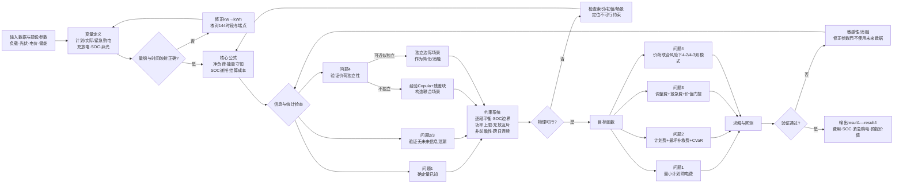

# C题完整数学模型构建：变量、假设、公式与流程

> 研究对象：含分布式光伏与储能的小区微网购电调度。本文承接前期确定的四问模型路线，统一采用“10分钟能量平衡—储能跨时段转移—日前计划—日内补救/调整”的建模主线。

## 1. 统一符号、索引与参数

### 1.1 索引集合

| 符号 | 含义 | 取值 |
| --- | --- | --- |
| $i$ | 日期索引 | 问题1为单日；问题2—4为2025-02-01至2025-12-31，共334日 |
| $t$ | 日内10分钟时段索引 | $t\in\mathcal T=\{1,2,\ldots,144\}$ |
| $\tau$ | 日内滚动决策时点 | $\tau\in\mathcal K=\{0,36,72,108\}$，对应0:00、6:00、12:00、18:00 |
| $\omega$ | 不确定场景索引 | $\omega\in\Omega=\{1,2,\ldots,S\}$ |
| $m$ | 问题4的运行模式 | $m\in\{4\text{-}2,4\text{-}3\}$ |

### 1.2 已知参数

| 参数 | 含义 | 类型 | 单位 | 数值或范围 |
| --- | --- | --- | --- | --- |
| $\Delta t$ | 单个调度时段长度 | 连续常数 | h | $1/6$ |
| $P^{\max}$ | 储能最大充/放电功率 | 连续常数 | kW | $5000$ |
| $B^{\max}$ | 单时段最大充/放电量，$P^{\max}\Delta t$ | 连续常数 | kWh | $833.333$ |
| $E^{\min},E^{\max}$ | 储能运行电量下、上限 | 连续常数 | kWh | $1200,10800$ |
| $E_{1,0}$ | 2025-01-01 0:00初始储电量 | 连续常数 | kWh | $6000$ |
| $\eta_c,\eta_d$ | 充电、放电效率 | 连续参数 | 无量纲 | 基准均取$0.90$；敏感性取$\sqrt{0.90}$ |
| $\bar P^{L}_{i,t}$ | 负载区间平均功率 | 连续参数 | kW | $[0,+\infty)$，由附件给定或预测 |
| $\bar P^{G}_{i,t}$ | 光伏区间平均功率 | 连续参数 | kW | $[0,+\infty)$，由附件给定或预测 |
| $L_{i,t},G_{i,t}$ | 负载、光伏区间电量 | 连续参数 | kWh | $[0,+\infty)$ |
| $p_{i,t}$ | 对应交易/交付时段基础电价 | 连续参数 | 元/kWh | 由附件1或附件4给定 |
| $\pi_\omega$ | 经验场景概率 | 连续参数 | 无量纲 | $[0,1]$且$\sum_\omega\pi_\omega=1$ |
| $\alpha$ | CVaR置信水平 | 连续参数 | 无量纲 | 通常取$[0.90,0.99]$，由滚动验证选定 |
| $\varepsilon_W$ | Wasserstein分布球半径 | 连续参数 | 与所选距离一致 | $[0,+\infty)$，由滚动验证选定 |
| $\lambda$ | 尾部风险权重 | 连续参数 | 无量纲 | $[0,+\infty)$ |
| $\epsilon_b$ | 储能吞吐微小惩罚系数 | 连续参数 | 元/kWh | $[0,+\infty)$，远小于最小有效价差 |
| $\rho$ | 调减电量的原计划费抵扣比例 | 连续口径参数 | 无量纲 | $\{0,1\}$分别表示“不抵扣”和“全额抵扣” |

## 2. 变量定义

为避免“计划量、实际取用量和紧急购电量”混用，本文把三者分开定义。下表中的范围均为模型硬范围；由供需关系自然得到的更紧范围不重复罗列。

### 2.1 决策变量

| 类别 | 变量 | 含义 | 适用问题 | 类型 | 单位 | 约束范围 |
| --- | --- | --- | --- | --- | --- | --- |
| 日前购电 | $q^0_{i,t}$ | 每日0:00承诺的计划购电量 | 2、3、4 | 连续 | kWh | $q^0_{i,t}\in[0,+\infty)$ |
| 确定性购电 | $q_t$ | 问题1中计划且实际使用的普通购电量 | 1 | 连续 | kWh | $q_t\in[0,+\infty)$ |
| 调整后购电 | $q^A_{i,t,\tau}$ | 在时点$\tau$形成的未来时段普通购电计划 | 3、4-3 | 连续 | kWh | $q^A_{i,t,\tau}\in[0,+\infty)$，仅$t>\tau$可变 |
| 实际取用 | $x^\omega_{i,t}$ | 场景$\omega$中从已付费计划量中实际取用的电量 | 2—4 | 连续 | kWh | $x^\omega_{i,t}\in[0,q^0_{i,t}]$；调整后相应上界换为已接受计划 |
| 紧急购电 | $h^\omega_{i,t}$ | 真实/场景缺口对应的紧急购电量 | 2—4 | 连续 | kWh | $h^\omega_{i,t}\in[0,+\infty)$ |
| 充电量 | $c^\omega_{i,t}$ | 母线侧送入储能的电量 | 1—4 | 连续 | kWh | $c^\omega_{i,t}\in[0,B^{\max}]$ |
| 放电量 | $d^\omega_{i,t}$ | 储能向母线侧输出的电量 | 1—4 | 连续 | kWh | $d^\omega_{i,t}\in[0,B^{\max}]$ |
| 储电量 | $E^\omega_{i,t}$ | 时段$t$末电池内部储电量 | 1—4 | 连续状态变量 | kWh | $E^\omega_{i,t}\in[1200,10800]$ |
| 弃光量 | $s^\omega_{i,t}$ | 无法被负载或储能吸收的光伏电量 | 1—4 | 连续 | kWh | $s^\omega_{i,t}\in[0,G^\omega_{i,t}]$ |
| 充放电模式 | $y^\omega_{i,t}$ | 1表示允许充电，0表示允许放电 | 1—4 | 二元离散 | 无量纲 | $y^\omega_{i,t}\in\{0,1\}$ |
| 调增量 | $u_{i,t,\tau}$ | 调整计划高于0:00计划的部分 | 3、4-3 | 连续 | kWh | $u_{i,t,\tau}\in[0,+\infty)$ |
| 调减量 | $v_{i,t,\tau}$ | 0:00计划高于调整计划的部分 | 3、4-3 | 连续 | kWh | $v_{i,t,\tau}\in[0,q^0_{i,t}]$ |
| 调整门控 | $g_{i,\tau}$ | 是否接受时点$\tau$的新方案 | 3、4-3 | 二元离散 | 无量纲 | $g_{i,\tau}\in\{0,1\}$ |
| CVaR阈值 | $\zeta$ | 成本分布的VaR辅助变量 | 2—4 | 连续 | 元 | $\zeta\in\mathbb R$ |
| CVaR超额 | $\xi_\omega$ | 场景成本超出$\zeta$的正部 | 2—4 | 连续 | 元 | $\xi_\omega\in[0,+\infty)$ |

注：问题1没有场景时，表中$c^\omega,d^\omega,E^\omega,s^\omega,y^\omega$去掉上标$\omega$即可。若赛事认定计划电必须全部交付，则将$x^\omega_{i,t}=q^0_{i,t}$，同时保留明确的弃电去向变量；不能把过量计划电从能量平衡中直接删除。

### 2.2 中间变量

| 类别 | 变量 | 含义 | 类型 | 单位 | 范围或定义 |
| --- | --- | --- | --- | --- | --- |
| 电量换算 | $L_{i,t}$ | 10分钟负载电量 | 连续 | kWh | $L_{i,t}=\bar P^L_{i,t}\Delta t\in[0,+\infty)$ |
| 电量换算 | $G_{i,t}$ | 10分钟光伏电量 | 连续 | kWh | $G_{i,t}=\bar P^G_{i,t}\Delta t\in[0,+\infty)$ |
| 净负荷 | $N_{i,t}$ | 光伏抵消后的外部净需求 | 连续 | kWh | $N_{i,t}=L_{i,t}-G_{i,t}\in\mathbb R$ |
| 预测分位数 | $\widetilde Q_{i,t}(a)$ | 融合模型给出的$a$分位净负荷 | 连续 | kWh | $\mathbb R$，$a\in(0,1)$ |
| 保形分数 | $A_j$ | 历史样本偏离预测区间的非符合度 | 连续 | kWh | $A_j\in[0,+\infty)$ |
| 校准半径 | $\kappa_i$ | 在线保形分位点 | 连续 | kWh | $\kappa_i\in[0,+\infty)$ |
| 场景补救费 | $R_i^\omega$ | 场景中的紧急费与储能吞吐惩罚 | 连续 | 元 | $R_i^\omega\in[0,+\infty)$ |
| 场景总成本 | $C_i^\omega$ | 计划费、调整费及补救费总和 | 连续 | 元 | 通常为$[0,+\infty)$；取决于结算口径 |
| 方案净价值 | $\Delta V_{i,\tau}$ | 保持旧方案与采用新方案的未来成本差 | 连续 | 元 | $\Delta V_{i,\tau}\in\mathbb R$ |
| 价值置信下界 | $\operatorname{LCB}_{1-\beta}$ | 净价值的块自助置信下界 | 连续 | 元 | $\mathbb R$ |
| 缺供风险 | $R^{\mathrm{short}}_{i,\tau}$ | 保持旧计划时发生紧急补购的概率或尾部电量 | 连续 | 无量纲或kWh | 按所选风险定义为$[0,1]$或$[0,+\infty)$ |
| 联合场景 | $\Xi_i^\omega$ | 完整日内价格—净负荷轨迹 | 连续向量 | 元/kWh、kWh | $\{(p^\omega_{i,t},N^\omega_{i,t})\}_{t=1}^{144}$ |

### 2.3 目标变量与评价变量

| 变量 | 含义 | 类型 | 单位 | 约束范围/用途 |
| --- | --- | --- | --- | --- |
| $C_1^*$ | 问题1最小购电费用 | 连续目标变量 | 元/日 | $[0,+\infty)$，目标为最小化 |
| $J_2^*$ | 问题2分布鲁棒风险调整总成本 | 连续目标变量 | 元/日或元/334日 | $[0,+\infty)$，目标为最小化 |
| $J_3^*$ | 问题3含调整、紧急补购和风险项的总成本 | 连续目标变量 | 元/日或元/334日 | $[0,+\infty)$，目标为最小化 |
| $J_{4-2}^*,J_{4-3}^*$ | 波动电价下两个模式的风险调整总成本 | 连续目标变量 | 元/334日 | $[0,+\infty)$，分别最小化 |
| $H=\sum_{i,t}h_{i,t}$ | 紧急购电总量 | 连续评价变量 | kWh | $[0,+\infty)$，越小越好但不是题面唯一目标 |
| $F_H$ | 发生紧急购电的时段比例 | 连续评价变量 | % | $[0,100]$ |
| $V_{\mathrm{forecast}}$ | 引入6:00/12:00/18:00预报带来的费用节省 | 连续评价变量 | 元 | $\mathbb R$，正值表示预报有经济价值 |
| $R_{\mathrm{bal}}$ | 最大逐时段能量平衡残差 | 连续验证变量 | kWh | 理论值为0，数值求解要求不大于容差 |

## 3. 核心假设及合理性

| 编号 | 核心假设 | 合理性说明 | 可能影响与处理 |
| --- | --- | --- | --- |
| H1 | 附件中的功率值代表对应10分钟区间的平均功率，可用“功率×$1/6$小时”换算为电量。 | 题目输出和调度粒度均为10分钟，这是把kW输入与kWh购电/储能变量放入同一守恒式的必要口径。 | 若时间戳实际表示区间端点，整体可能错移10分钟；需用左右端两种映射做敏感性复算。 |
| H2 | 将储能视为一台等效设备，同一时段不能同时充放电；基准情形取$\eta_c=\eta_d=0.90$，忽略自放电、线路损耗和未给定的老化成本。 | 题面只给出一组容量、功率和效率参数，没有提供设备分组、线路或退化参数；合并为等效设备可保持模型可识别且满足主要物理约束。 | 单向效率与往返效率存在歧义，另以$\eta_c=\eta_d=\sqrt{0.90}$复算；对吞吐惩罚做敏感性分析，防止过度循环。 |
| H3 | 小区负载不可削减，外部电网可提供足量普通或紧急电；题面未规定上网售电，因此禁止$q<0$，富余光伏只能充电或弃光。 | “供电量不能低于负载”是题目硬要求，而题面没有给出失负荷许可、并网购电上限或售电收益。 | 该假设保证每个场景可行；工程应用若存在外网容量上限，应新增容量约束及失负荷惩罚变量。 |
| H4 | 问题2—4严格遵守信息因果性：任一决策只能使用该时点前已观测数据和已发布预报；全年真实值只用于到达后的执行与回测。 | 题目明确了0:00计划和6:00/12:00/18:00预报发布时点，使用未来真实值会形成不可实施的“先知解”。 | 训练和回测采用扩展窗口；通过“发布时间$\le$决策时点”审计表检查数据泄漏。 |
| H5 | 问题1满足$E_{144}=E_0$；问题2—4按物理连续运行，前一日24:00储电量等于次日0:00储电量，不把每天初值重置为6000 kWh。计划电主口径为“按计划付费、允许少取”；问题3的调减结算和问题4的电价可得性均做双口径复算。 | 日首尾相等是问题1明示条件；跨日连续符合储能状态物理意义。后三问部分结算/信息规则存在题意歧义，显式设置口径参数比隐含假定更可靠。 | 主结果须注明$\rho$和价格信息口径；若不同口径改变策略结论，应并列报告，不能只选费用更低的一种。 |

这些假设没有虚构碳价、售电收入、并网容量、线路潮流或电池寿命等题面未给定参数，既保留了核心物理机制，又控制了不可识别因素的数量。

## 4. 统一物理模型推导

### 4.1 从功率到区间电量

对第$i$日第$t$个10分钟区间，若附件给出区间平均功率，则

$$
L_{i,t}=\bar P^L_{i,t}\Delta t,\qquad
G_{i,t}=\bar P^G_{i,t}\Delta t,\qquad \Delta t=\frac16\ \mathrm h. \tag{1}
$$

式(1)把kW统一转换为kWh，是后续能量守恒成立的量纲基础。例如5000 kW在一个10分钟区间内最多转移$5000/6=833.333$ kWh。

定义净负荷

$$
N_{i,t}=L_{i,t}-G_{i,t}. \tag{2}
$$

式(2)表示光伏就地抵消负载后的净外部需求；$N_{i,t}<0$表示该时段光伏有富余。

### 4.2 母线能量守恒

在场景$\omega$中，普通购电、紧急购电、光伏和储能放电构成能量来源，负载、充电和弃光构成能量去向：

$$
x_{i,t}^{\omega}+h_{i,t}^{\omega}+G_{i,t}^{\omega}+d_{i,t}^{\omega}
=L_{i,t}^{\omega}+c_{i,t}^{\omega}+s_{i,t}^{\omega}. \tag{3}
$$

式(3)表示每个10分钟时段的供需平衡。使用等式而非“供给不低于负载”的不等式，可迫使模型解释所有富余电量的物理去向。问题1中令$x_t=q_t$、$h_t=0$。

弃光只能来自光伏：

$$
0\le s_{i,t}^{\omega}\le G_{i,t}^{\omega}. \tag{4}
$$

式(4)防止模型把已经付费的普通购电伪装成“弃光”无代价倾倒。

### 4.3 储能状态转移

以电池内部电量为状态、母线侧充放电量为流量，有

$$
E_{i,t}^{\omega}=E_{i,t-1}^{\omega}
+\eta_c c_{i,t}^{\omega}-\frac{d_{i,t}^{\omega}}{\eta_d}. \tag{5}
$$

式(5)表示充入$c$ kWh后只有$\eta_c c$进入电池，而向母线交付$d$ kWh需要从电池消耗$d/\eta_d$ kWh。

安全边界和功率边界为

$$
E^{\min}\le E_{i,t}^{\omega}\le E^{\max},\qquad
0\le c_{i,t}^{\omega}\le B^{\max}y_{i,t}^{\omega},\qquad
0\le d_{i,t}^{\omega}\le B^{\max}(1-y_{i,t}^{\omega}). \tag{6}
$$

式(6)分别表示储能运行在10%—90%额定容量区间内、单段充放电量不超过833.333 kWh，并通过二元变量$y$禁止同段充放电。

### 4.4 日内闭环与跨日衔接

问题1要求

$$
E_{144}=E_0. \tag{7}
$$

式(7)使当天成本优化不能通过透支次日可用电量获得虚假收益。问题2—4采用

$$
E_{i+1,0}^{\omega}=E_{i,144}^{\omega}. \tag{8}
$$

式(8)表示储能跨日连续。若同时强制每天首尾相等，会不必要地限制跨日低价储能价值，因此后三问只在评价期末设置软终端目标或残值，而不逐日重置。

## 5. 问题1：时空能量网络广义最小费用流模型

问题1的负载、光伏和电价均已知，不需要概率预测。将每个时段视作能量网络节点，把储能视作跨时段运输弧，即可得到确定性混合整数线性模型。

### 5.1 目标函数推导

第$t$段普通购电成本为$p_tq_t$，全天购电成本为

$$
C_{\mathrm{grid}}=\sum_{t=1}^{144}p_tq_t. \tag{9}
$$

为在多个等成本解中优先选择较少的无效储能循环，加入远小于有效价差的吞吐惩罚：

$$
C_{\mathrm{throughput}}=\epsilon_b\sum_{t=1}^{144}(c_t+d_t). \tag{10}
$$

因此问题1目标为

$$
\boxed{
C_1^*=\min_{q,c,d,E,s,y}
\left[\sum_{t=1}^{144}p_tq_t+
\epsilon_b\sum_{t=1}^{144}(c_t+d_t)\right]
} \tag{11}
$$

式(11)表示在满足逐时段保供、储能安全和日首尾电量一致的前提下，使计划购电费最小；$\epsilon_b$只负责破除退化解，不改变主要经济目标。

### 5.2 完整约束组

$$
q_t+G_t+d_t=L_t+c_t+s_t,\qquad t=1,\ldots,144, \tag{12}
$$

$$
E_t=E_{t-1}+\eta_cc_t-\frac{d_t}{\eta_d}, \tag{13}
$$

$$
1200\le E_t\le10800,\quad
0\le c_t\le833.333y_t,\quad
0\le d_t\le833.333(1-y_t), \tag{14}
$$

$$
0\le s_t\le G_t,\quad q_t\ge0,\quad y_t\in\{0,1\},\quad E_{144}=E_0. \tag{15}
$$

式(12)—(15)依次表示节点能量平衡、带效率的储能运输、容量/功率/互斥限制，以及弃光、购电非负和首尾闭环。目标与约束均为线性，唯一离散变量为$y_t$，因此属于MILP；若先放松$y_t$，可得到稀疏LP下界，再用互斥模型复核。

## 6. 问题2：在线保形净负荷预测—分布鲁棒两阶段调度

问题2中，0:00需要先承诺$q^0$，真实净负荷到达后才能决定实际取用、储能动作和紧急补购，因此属于“先计划、后补救”的两阶段不确定优化。

### 6.1 净负荷概率预测

对分位水平$a\in(0,1)$，分位数模型的Pinball损失定义为

$$
\ell_a(e)=
\begin{cases}
ae,& e\ge0,\\
(a-1)e,& e<0,
\end{cases}
\qquad e=N_{i,t}-\widehat Q_{i,t}(a). \tag{16}
$$

式(16)对低估和高估给予不对称惩罚，使模型可直接学习净负荷的不同条件分位数，而不只输出均值。

设$m\in\{\mathrm{sim},\mathrm{qts}\}$分别代表相似日模型和分位数时序模型，最近滚动窗口平均损失为$\bar\ell_{m,i}$，动态权重取

$$
w_{m,i}=\frac{\exp(-\gamma\bar\ell_{m,i})}
{\sum_r\exp(-\gamma\bar\ell_{r,i})},\qquad
\widetilde Q_{i,t}(a)=\sum_m w_{m,i}\widehat Q^{(m)}_{i,t}(a). \tag{17}
$$

式(17)使近期分位数损失更小的模型获得更高权重；2月冷启动阶段相似日模型通常更稳定，样本积累后权重可自动转移。

### 6.2 在线保形校准

在只包含过去日期的校准集$\mathcal C_i$上，定义非符合度

$$
A_j=\max\left\{
\widetilde Q_{j,t}(a_L)-N_{j,t},\ 
N_{j,t}-\widetilde Q_{j,t}(a_U),\ 0
\right\}. \tag{18}
$$

取$\kappa_i$为$\{A_j:j\in\mathcal C_i\}$的有限样本修正$(1-\alpha_c)$分位点，则校准区间为

$$
\mathcal I_{i,t}=
\left[
\widetilde Q_{i,t}(a_L)-\kappa_i,
\widetilde Q_{i,t}(a_U)+\kappa_i
\right]. \tag{19}
$$

式(18)—(19)用近期真实误差自适应扩张或收缩预测区间，不要求残差服从正态分布。校准必须按“日期整块”或按提前量分层进行，避免把强相关的144个时段误当成144个独立样本。

由校准分位数或历史残差块生成$S$条完整日内净负荷场景$N_{i,t}^{\omega}$，并用前向场景缩减保留中心场景与尾部场景。

### 6.3 两阶段补救约束

0:00第一阶段确定$q^0_{i,t}$；场景到达后第二阶段满足

$$
0\le x_{i,t}^{\omega}\le q^0_{i,t}, \tag{20}
$$

$$
x_{i,t}^{\omega}+h_{i,t}^{\omega}+G_{i,t}^{\omega}+d_{i,t}^{\omega}
=L_{i,t}^{\omega}+c_{i,t}^{\omega}+s_{i,t}^{\omega}, \tag{21}
$$

并同时满足式(4)—(6)、式(8)。式(20)表示计划量按$q^0$付费，但执行时可以少取；式(21)表示少计划造成的缺口由储能或5倍电价的紧急购电补足。

为禁止场景解偷看未来，可用以下任一等价方式施加非前瞻性：

1. 场景树中具有相同历史的节点共享同一个$c,d,x$决策；
2. 使用因果仿射储能策略

$$
c_{i,t}^{\omega}-d_{i,t}^{\omega}
=b_{i,t}+\sum_{k=1}^{t}K_{i,t,k}
\left(N_{i,k}^{\omega}-\widehat N_{i,k}\right),
\qquad K_{i,t,k}=0\quad(k>t). \tag{22}
$$

式(22)表示第$t$段动作只能响应截至$t$段已经观察到的预测误差，不能依赖未来$k>t$的真实值。

### 6.4 分布鲁棒风险目标

场景$\omega$的补救成本定义为

$$
R_i^{\omega}=\sum_{t=1}^{144}
\left[5p_{i,t}h_{i,t}^{\omega}
+\epsilon_b(c_{i,t}^{\omega}+d_{i,t}^{\omega})\right], \tag{23}
$$

总成本为

$$
C_i^{\omega}=\sum_{t=1}^{144}p_{i,t}q^0_{i,t}+R_i^{\omega}. \tag{24}
$$

以经验分布$\widehat{\mathbb P}_i$为中心构造Wasserstein分布集合

$$
\mathcal P_i(\varepsilon_W)=
\left\{\mathbb P:W_1(\mathbb P,\widehat{\mathbb P}_i)\le\varepsilon_W\right\}. \tag{25}
$$

式(25)允许真实分布在有限历史场景附近发生偏移，降低2月初小样本及季节变化造成的虚假乐观。

CVaR的样本线性化为

$$
\operatorname{CVaR}_{\alpha}(C_i)
=\min_{\zeta,\xi}
\left\{
\zeta+\frac{1}{1-\alpha}\sum_{\omega\in\Omega}\pi_\omega\xi_\omega
\right\}, \tag{26}
$$

$$
\xi_\omega\ge C_i^\omega-\zeta,\qquad \xi_\omega\ge0. \tag{27}
$$

最终目标为

$$
\boxed{
J_2^*=\min
\left\{
\sum_t p_{i,t}q^0_{i,t}
+\sup_{\mathbb P\in\mathcal P_i(\varepsilon_W)}
\mathbb E_{\mathbb P}[R_i]
+\lambda\operatorname{CVaR}_{\alpha}(C_i)
\right\}
} \tag{28}
$$

式(28)同时权衡必付的计划费、分布偏移下最坏期望补救费和尾部总成本。$\lambda=0$时只控制最坏期望；$\lambda>0$时进一步抑制少数极高紧急费日期。$\varepsilon_W$、$\lambda$和$\alpha$均须用过去滚动验证集选择，不能用全年测试结果倒推。

## 7. 问题3：价值门控自适应滚动MPC

问题3新增6:00、12:00、18:00光伏预报。新预报并不自动等于值得调整，因为调增、调减和紧急购电均有不同价格。模型在每次发布时点同时评估“保持旧计划”和“采用新计划”。

### 7.1 冻结已执行部分

在时点$\tau$，所有$t\le\tau$的购电和储能动作均固定为实际已执行值，剩余时域以实测状态为初值：

$$
q_{i,t}^{\mathrm{new}}=q_{i,t}^{\mathrm{exec}},\quad
c_{i,t}^{\mathrm{new}}=c_{i,t}^{\mathrm{exec}},\quad
d_{i,t}^{\mathrm{new}}=d_{i,t}^{\mathrm{exec}}\quad(t\le\tau),
\qquad E_{i,\tau}^{\mathrm{new}}=E_{i,\tau}^{\mathrm{obs}}. \tag{29}
$$

式(29)是滚动优化的不可逆性约束，防止模型在获得新信息后“修改历史”。

### 7.2 调增、调减线性化

对$t>\tau$，令最终候选计划满足

$$
q^A_{i,t,\tau}=q^0_{i,t}+u_{i,t,\tau}-v_{i,t,\tau},\qquad
u_{i,t,\tau}\ge0,\quad v_{i,t,\tau}\ge0. \tag{30}
$$

式(30)把相对0:00计划的变化拆为非负调增和调减量；在正费用系数下，最优解不会同时调增和调减同一电量。必要时可再用二元变量和Big-$M$显式保证互斥。

调减规则存在两种合理解释。用$\rho\in\{0,1\}$表示调减部分是否退回原计划费，则场景总费用统一写为

$$
C_{3,i}^{\omega}=
\sum_t p_{i,t}q^0_{i,t}
+\sum_t\left[
1.5p_{i,t}u_{i,t}
+(0.5-\rho)p_{i,t}v_{i,t}
+5p_{i,t}h_{i,t}^{\omega}
\right]
+\epsilon_b\sum_t(c_{i,t}^{\omega}+d_{i,t}^{\omega}). \tag{31}
$$

式(31)中，$\rho=0$表示原计划费保留且调减另付50%违约费；$\rho=1$表示先退回调减部分原计划费，再支付50%违约费。两种口径必须分别求解并比较。

### 7.3 经济价值门控

在更新时点$\tau$，以当时信息集$\mathcal F_{i,\tau}$重新生成剩余时域场景，分别求得

$$
J^{\mathrm{keep}}_{i,\tau}
=\operatorname{RiskCost}(\text{保持当前计划}\mid\mathcal F_{i,\tau}), \tag{32}
$$

$$
J^{\mathrm{new}}_{i,\tau}
=\min\operatorname{RiskCost}(\text{采用新预报重优化}\mid\mathcal F_{i,\tau}). \tag{33}
$$

净价值为

$$
\Delta V_{i,\tau}=J^{\mathrm{keep}}_{i,\tau}-J^{\mathrm{new}}_{i,\tau}. \tag{34}
$$

式(34)为正表示采用新预报在当前估计下更省钱。为避免一次偶然预测修正驱动调整，对历史同发布时点和相似提前量的$\Delta V$按“日期块”自助抽样$B$次，并取

$$
\operatorname{LCB}_{1-\beta}(\Delta V_{i,\tau})
=Q_{\beta}\left(\Delta V_{i,\tau}^{*(1)},\ldots,
\Delta V_{i,\tau}^{*(B)}\right). \tag{35}
$$

式(35)给出净收益的保守下界。再定义保持计划时的保供风险，例如

$$
R^{\mathrm{short}}_{i,\tau}
=\Pr\left(\sum_{t>\tau}h_{i,t}^{\mathrm{keep}}>0
\mid\mathcal F_{i,\tau}\right). \tag{36}
$$

门控规则为

$$
g_{i,\tau}=
\begin{cases}
1,& \operatorname{LCB}_{1-\beta}(\Delta V_{i,\tau})>\delta
\ \text{或}\ R^{\mathrm{short}}_{i,\tau}>\bar r,\\
0,& \text{其他情况}.
\end{cases} \tag{37}
$$

式(37)包含两条触发通道：经济收益足够可靠时调整；即使收益证据不足，只要保留计划的缺供风险超过阈值，也强制调整。

接受后的未来计划为

$$
q^{\mathrm{acc}}_{i,t,\tau}
=(1-g_{i,\tau})q^{\mathrm{keep}}_{i,t,\tau}
+g_{i,\tau}q^{\mathrm{new}}_{i,t,\tau},\qquad t>\tau. \tag{38}
$$

式(38)表示门控只在外层选择两个已经求得的方案，不产生决策变量乘积，因此实际实现可保持为“两个优化模型＋一次规则判断”。

问题3最终在式(3)—(6)、式(8)、式(20)、式(29)—(30)约束下最小化式(31)对应的分布鲁棒风险成本，得到$J_3^*$。是否需要引入额外时点预报，则由$V_{\mathrm{forecast}}$的配对日成本差、置信区间、紧急购电量和门控触发率共同判断，而不能只比较预测RMSE。

## 8. 问题4：价荷Copula耦合场景—双模式分布鲁棒调度

问题4的关键不只是把固定电价列换成附件4，而是处理“高净负荷与高电价同时发生”带来的联合尾部风险。

### 8.1 价荷联合场景

分别对价格和净负荷建立条件边际模型，得到标准化残差$e^p_j,e^N_j$。用各自经验分布函数变换为秩变量

$$
U_j=\widehat F_p(e^p_j),\qquad
V_j=\widehat F_N(e^N_j). \tag{39}
$$

经验Copula为

$$
\widehat C(u,v)=\frac1M\sum_{j=1}^{M}
\mathbf 1(U_j\le u,V_j\le v). \tag{40}
$$

式(39)—(40)分离“各变量自身分布”和“变量之间依赖结构”。采用整日或连续时段残差块重采样，再按$\widehat C$秩匹配，可生成

$$
\Xi_i^\omega=
\left\{(p_{i,t}^{\omega},N_{i,t}^{\omega}):t=1,\ldots,144\right\}. \tag{41}
$$

式(41)同时保留价格—净负荷相关性和日内连续性。建模前必须检验二者是否可视为独立：按季节、工作日/周末和峰谷时段计算Spearman $\rho_s$、Kendall $\tau_K$并进行日期块置换检验。若相关性不显著且Copula模型在滚动验证中无成本改善，可退化为独立边际场景；若显著，则随机拼接两个边际分布会低估联合风险。

### 8.2 双模式费用

4-2模式沿用问题2的信息集，只允许0:00计划和事后紧急补救：

$$
C_{4-2,i}^{\omega}=\sum_t p_{i,t}^{\omega}q^0_{i,t}
+\sum_t5p_{i,t}^{\omega}h_{i,t}^{\omega}
+\epsilon_b\sum_t(c_{i,t}^{\omega}+d_{i,t}^{\omega}). \tag{42}
$$

4-3模式沿用问题3的四次滚动调整：

$$
C_{4-3,i}^{\omega}=\sum_t p_{i,t}^{\omega}q^0_{i,t}
+\sum_t\left[
1.5p_{i,t}^{\omega}u_{i,t}
+(0.5-\rho)p_{i,t}^{\omega}v_{i,t}
+5p_{i,t}^{\omega}h_{i,t}^{\omega}
\right]
+\epsilon_b\sum_t(c_{i,t}^{\omega}+d_{i,t}^{\omega}). \tag{43}
$$

式(42)与式(43)只在信息节点和调整权限上不同，物理参数、场景库、初始SOC和风险参数保持一致，使两模式的成本差具有可比性。

### 8.3 统一风险目标

对$m\in\{4\text{-}2,4\text{-}3\}$，目标为

$$
\boxed{
J_m^*=\min
\sup_{\mathbb P\in\mathcal P_i(\varepsilon_W)}
\left\{
\mathbb E_{\mathbb P}[C_{m,i}]
+\lambda\operatorname{CVaR}_{\alpha}^{\mathbb P}(C_{m,i})
\right\}
} \tag{44}
$$

式(44)表示在可能偏离经验场景分布的价荷联合分布中，使最坏期望成本和尾部风险之和最小。若次日144段电价在0:00已经公布，则令$p_{i,t}^{\omega}=p_{i,t}$，价格边际退化为单点；若未公布，则只能用截至决策时点的历史价格预测。两类结果必须分表报告。

## 9. 求解与验证标准

### 9.1 求解顺序

1. 先按式(1)完成量纲统一和时间索引映射。
2. 问题1求连续松弛以获得成本下界和影子价格，再启用$y_t$求MILP物理解。
3. 问题2从1月历史冷启动，自2月1日起逐日更新预测、保形分数、场景和计划，实际执行后再把当天误差加入历史。
4. 问题3在每日0:00、6:00、12:00、18:00执行“保持方案—候选方案—价值门控”，每次冻结过去并以当前SOC重启。
5. 问题4在完全相同的日期、初始状态、场景数和风险参数下分别求4-2与4-3，避免把抽样差异误判为调整机制收益。

### 9.2 必须通过的数值检查

| 检查项 | 指标 | 合格标准 |
| --- | --- | --- |
| 能量守恒 | $R_{\mathrm{bal}}=\max|x+h+G+d-L-c-s|$ | 不大于求解容差，建议$10^{-6}$ kWh量级 |
| SOC安全 | $\min E,\max E$ | 始终位于$[1200,10800]$ kWh |
| 功率安全 | $\max c,\max d$ | 均不超过$833.333$ kWh/10分钟 |
| 充放电互斥 | $\sum_{i,t}\min(c_{i,t},d_{i,t})$ | 等于0或仅有数值容差 |
| 问题1边界 | $|E_{144}-E_0|$ | 不大于求解容差 |
| 跨日连续 | $\max_i|E_{i+1,0}-E_{i,144}|$ | 不大于求解容差 |
| 信息因果性 | 训练/场景数据的最晚发布时间 | 不晚于当前决策时点 |
| 预测校准 | 区间经验覆盖率 | 接近目标覆盖率，并按季节、昼夜报告 |
| 场景收敛 | $S=20,50,100$时目标值变化 | 达到预设稳定阈值后才采用 |
| 鲁棒性 | 效率、$\rho$、价格可得性、$\lambda$、$\varepsilon_W$变化 | 关键策略结论不应依赖单一未经说明口径 |
| 价荷依赖 | 分层秩相关、日期块置换$p$值、独立/Copula消融 | 证明是否确有必要使用联合场景 |

## 10. 建模流程图

下图严格按“变量→公式→约束→目标”组织，并把时间映射、信息因果性、变量独立性和物理可行性设置为必须通过的检查节点。

### 流程中关键节点的含义

- “量纲与时间映射正确？”：解决kW与kWh不能直接相加、附件时间戳与结果模板可能错位的问题。
- “验证无未来信息泄漏”：确保问题2—4的计划在真实运行中可执行，而不是利用全年数据得到的先知下界。
- “验证价荷独立性”：决定问题4是否需要Copula；若不检验就直接假设独立，可能漏掉高价与高净负荷共现的尾部损失。
- “物理可行？”：先判断每个场景是否满足逐段保供、SOC和功率边界，再讨论成本最优，避免得到费用低但无法执行的方案。
- “敏感性/消融”：只用过去验证集选择参数，并分别检验效率口径、调减结算、价格信息、DRO半径、CVaR权重和预报发布时间的影响。

## 11. 可直接用于论文的模型概括

本文将小区微网调度统一表述为带储能状态的多阶段能量流优化。问题1在负载、光伏和电价确定时，以144层时空能量网络求最小购电费用；问题2在0:00信息不完全时，先以在线组合分位数模型和保形校准生成净负荷场景，再用两阶段分布鲁棒优化平衡计划费、5倍紧急购电费和尾部风险；问题3在6:00、12:00、18:00获得新预报后，通过价值门控MPC，仅在经济收益置信下界超过阈值或保供风险过高时调整未来计划；问题4进一步构建价格—净负荷联合场景，在同一物理约束和风险口径下分别求解4-2日前补救模式与4-3滚动调整模式。整个模型严格满足10分钟能量守恒、储能容量与功率限制、充放电互斥、跨日状态连续和信息非前瞻性，并通过口径敏感性、场景收敛和消融实验验证结论稳健性。
