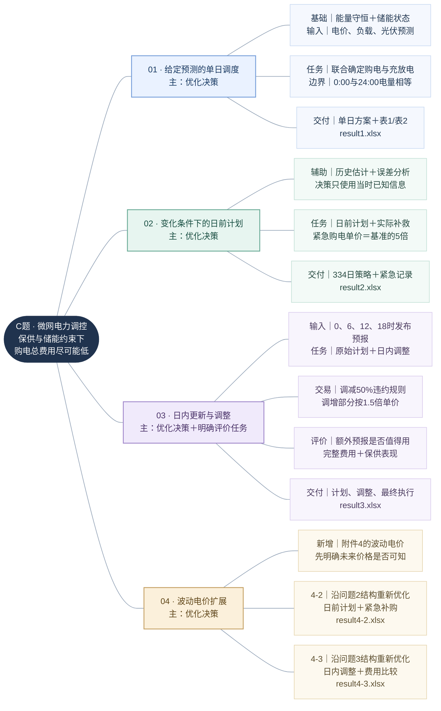
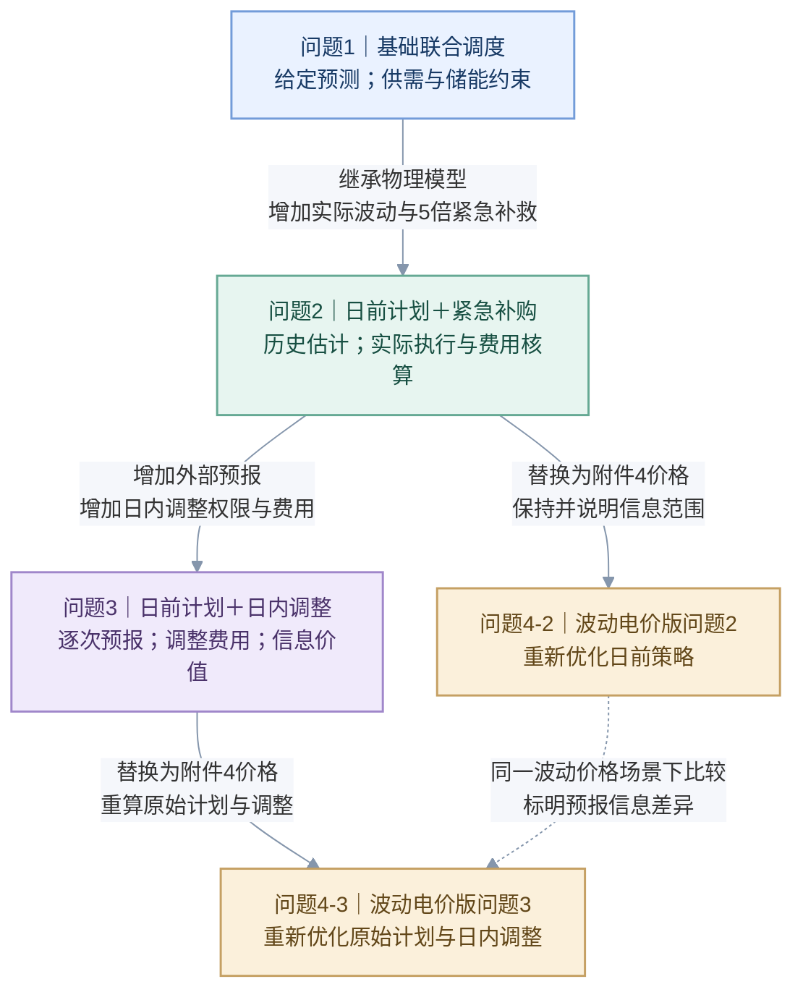

# C题：题型归类与逻辑思维导图

来源：`D:\mathmodel\SXJM\C题.docx`。承接《C题_逐句解析》和《C题_分问目标与递进逻辑》。日期：2026-09-11。

## 1. 归类口径

题型依据“最后需要回答什么、交付什么”判定，不能只看题目出现的名词或准备采用的算法。主导题型、辅助题型和必要的建模基础可以同时存在。

本题四问均以**优化决策类**为主：在供电与储能约束下选择购电、充放电以及允许的调整动作，使购电费用尽可能低。问题3还明确要求评价日内额外预报的必要性。机理、预测、统计和评价在各问中的地位不同；题目未要求独立构建电网网络。

| 题型 | 判断依据 | 在本题中如何识别 | 不能据此直接归类 |
| --- | --- | --- | --- |
| 机理分析类 | 核心任务是解释系统运行规律、建立机制关系或识别机理参数 | 能量守恒、储能动态、效率及边界构成各问的建模基础 | 使用能量方程并不意味着题目主要要求解释电池机理或辨识电化学参数 |
| 预测建模类 | 核心任务是依据现有信息估计未知的未来量或其分布 | 问题2的日前输入估计；问题3的预报处理；未来电价未知时问题4的价格估计 | 已给出的光伏预报不等于必须再训练一个光伏预测模型；变化数据也不自动指定LSTM等方法 |
| 评价分析类 | 核心任务是判断方案、信息或措施的效果、价值或必要性 | 问题3明确要求分析是否需要其他时刻的预报；问题4可开展场景效果比较 | 评价不等于必须采用AHP、TOPSIS或构造综合评分；直接比较完整费用与保供表现即可有针对性地评价 |
| 优化决策类 | 需要在约束下选择可控变量，获得目标尽可能好的方案 | 各问都要求制定购电与储能策略，问题3及4-3还可调整未来购电 | 仅拟合数据、画图或计算已有方案的账单，不能替代求解策略 |
| 统计分析类 | 核心任务是描述、估计或检验数据结构、差异与不确定性 | 历史负载/光伏规律、预测误差、价格变化及策略表现的统计分析 | 读取Excel、求和、做报表本身不构成独立的统计分析题 |
| 网络构建类 | 要求定义或识别节点、边、连接关系、拓扑或网络结构，并据此分析 | 题面未给电网节点、线路、阻抗或拓扑构建目标，不作为本题独立类型 | “微网”“外网”只是系统对象名称，不能据此认定是复杂网络、图学习或最短路题 |

## 2. 每一问的主辅题型与判定依据

| 问题 | 主导题型 | 辅助题型/基础 | 题面判定依据 | 为什么这样归类 | 范围限定 |
| --- | --- | --- | --- | --- | --- |
| 问题1 | 优化决策类 | 机理分析作为建模基础；结果检验作为支撑 | “制定……计划购电策略的数学模型”“给出具体的计划购电策略”；总体目标要求保供且节省购电费用 | 电价、负载及光伏预测作为输入，需选择购电和充放电动作；供需、储能容量/功率及首尾电量条件限定可行域，费用用于比较方案 | 光伏预测已给定，不必另设预测建模任务；没有机理参数辨识或网络构建要求。依据S06—S09 |
| 问题2 | 优化决策类 | 预测建模、统计分析作为辅助；机理分析为基础 | “小区负载和光伏发电功率随时间变化”“每天0:00制定”“紧急购电……5倍”“按计划购电量计算” | 日前决策需要处理未来负载/光伏未知性；历史估计、情景或稳健不确定集支撑计划；最终仍要选择购电与储能动作并权衡计划费用和高价补救 | 预测方法属于支撑性选择，题面未要求独立预测文件；已有未来实际记录不能当作日前已知输入。依据S10—S14 |
| 问题3 | 优化决策类 | 评价分析类为明确的并行任务；预报处理与统计分析辅助；机理分析为基础 | “调整购电策略”“总的购电费用包括……”“请分析是否需要引入其他时刻的预报” | 一部分任务是选择日前与日内动作，另一部分明确要求判断额外预报的经济价值；因此应同时交付策略和必要性评价，费用构成必须完整 | 已提供外部预报，额外训练模型非必需；判断预报价值不等于只比较预测误差。依据S15—S23 |
| 问题4 | 优化决策类，分4-2和4-3两支 | 统计分析和效果评价辅助；价格未知时预测建模辅助；机理分析为基础 | “电价也是实时波动的”“建立……数学模型”“在波动电价下重新计算问题2和问题3” | 电价改变会影响购电时机、储能安排与调整选择，因此要分别重求两类策略；价格统计和方案比较支持解释结果 | 未来价格是否已公布需约定，不能把价格预测说成无条件必做；4-3可沿用问题3的预报价值评价方法，但问题4没有另行明示一次“是否需要”的问句。依据S24—S27、S50—S52 |

若必须为每个大问选择且只选择一个题型，四问均选择**优化决策类**。若允许复合题型，问题3应写为“优化决策＋评价分析”，问题2可写为“预测/不确定性分析支撑的优化决策”，问题4可写为“价格变化条件下的优化决策及效果比较”。

## 3. 六类题型对应矩阵

符号：**主**＝直接决定本问最终成果；**辅**＝辅助任务或分析；**基**＝建模基础；**条件**＝在特定信息假设或方法选择下需要；**—**＝不构成本问独立题型。一般性结果检查不自动计为独立评价分析题。

| 问题/分支 | 机理分析类 | 预测建模类 | 评价分析类 | 优化决策类 | 统计分析类 | 网络构建类 |
| --- | --- | --- | --- | --- | --- | --- |
| 问题1 | 基：守恒、状态及效率 | —：题面已给预测 | —：可行性检验是支撑 | 主 | —：普通整理不单独归类 | — |
| 问题2 | 基：储能与保供 | 辅：未来负载/光伏估计或情景；也可用稳健不确定集 | 辅：效果对比，非单独明示问项 | 主 | 辅：历史结构、误差与回测 | — |
| 问题3 | 基：状态连续与设备限额 | 辅：已给预报的对齐、融合或校正；不强制另训模型 | 明确任务：额外预报是否必要 | 主 | 辅：预报误差与对照证据 | — |
| 问题4-2 | 基：同问题2 | 条件：延续负载/光伏估计；价格未知时增加价格估计 | 辅：新价格场景下的效果 | 主 | 辅：价格变化与实际费用 | — |
| 问题4-3 | 基：同问题3 | 条件：处理给定光伏预报；价格未知时增加价格估计 | 辅：可复用预报价值评价；价格场景比较 | 主 | 辅：价格、预报误差与对照 | — |

矩阵中的“主、辅、基”表示任务地位，不是工作量比例、评分权重或已经计算出的数值。

## 4. 对前一份16项子任务的细分归类

| 子任务 | 子任务题型/性质 | 判定依据 |
| --- | --- | --- |
| 1.1 建立单日模型 | 优化决策建模；机理基础 | 目标、决策变量和约束构成优化模型；能量守恒和储能状态是约束来源 |
| 1.2 求解具体策略 | 优化决策类 | 需要求出给定条件下费用尽可能低的动作序列，并报告求解证据 |
| 1.3 汇总与提交 | 成果汇总，不独立归入六类 | 表格、文件和图形是成果载体；单纯汇总不是新的统计或评价问题 |
| 2.1 构造日前输入 | 预测建模/统计分析辅助 | 依据历史信息估计未来量、误差或不确定范围，方法未被题面限定 |
| 2.2 制定日前计划 | 优化决策类 | 选择计划购电与储能动作，权衡普通费用和紧急补救代价 |
| 2.3 执行与补购 | 决策执行、机理仿真与统计核验 | 沿时间推进实际电量状态，补足缺口并核算；若实时补救再优化，则该部分也是优化决策 |
| 2.4 全期汇总 | 成果汇总；统计分析支撑 | 按日期/时段汇总实际结果；只有进行误差、差异或分布分析时才形成统计分析任务 |
| 3.1 对齐预报 | 数据处理；预测与统计支撑 | 保留发布时间和目标时刻，正确接入已给预报；时间映射本身不是训练预测模型 |
| 3.2 形成0:00计划 | 优化决策类 | 给定当时信息，形成原始购电与储能计划 |
| 3.3 日内调整 | 优化决策类 | 在新信息、当前状态和调整费用约束下选择未执行时段的动作 |
| 3.4 预报必要性 | 评价分析类，统计对照支撑 | 明确回答信息是否值得引入，以实际完整费用及保供表现为证据 |
| 3.5 最终结果提交 | 成果汇总与追溯 | 区分原始、调整和最终执行版本，按模板保存 |
| 4.1 波动电价模型 | 优化决策建模；统计/预测条件辅助 | 价格进入目标函数；价格可得性决定是否需要另做预测或情景 |
| 4.2 重算问题2 | 优化决策类 | 波动电价下重求日前计划与紧急补救策略 |
| 4.3 重算问题3 | 优化决策类；评价分析辅助 | 重求日前与日内动作，可继续比较预报更新价值 |
| 4.4 场景展示与解释 | 评价/统计分析支撑及成果汇总 | 解释不同价格与调度机制下的结果差异，保持比较条件明确 |

## 5. 全题思维导图

颜色用于区分问题分支：蓝色＝问题1基础调度，青绿＝问题2变化与补救，紫色＝问题3更新与评价，金色＝问题4价格扩展。每个分支同时保留文字编号，颜色不承载唯一含义。

说明：“334日”对应2025-02-01至12-31；问题3及问题4的完整输出也覆盖该期间。预报处理、统计分析及评价是辅助或并行任务，不能据导图误认为题目要求将全部方法强行串联。

## 6. 小问递进与逻辑对接图

本图的实线箭头表示模型或任务继承；虚线表示同场景比较，不表示后一个方案直接继承前一个方案的数值结果。

### 6.1 关键接口

| 逻辑接口 | 传递或继承什么 | 新增什么 | 不可混用的内容 |
| --- | --- | --- | --- |
| 问题1 → 问题2 | 守恒、储能动态、设备边界、成本与报表程序 | 未知负载/光伏、历史估计、紧急补救与回测 | 不能把问题1的具体购电数值复制到全年；每日首尾相等是否继承需明示 |
| 问题2 → 问题3 | 日前计划、实际执行、当前储电量与紧急补购核算 | 外部预报、日内调整、调整费用与必要性评价 | 不能覆盖原0:00计划；不能在较早时刻使用较晚预报 |
| 问题2/3 → 问题4两支 | 各自策略结构、物理约束与输出口径 | 波动价格、价格信息边界与重新优化 | 对旧方案换价算账不是重新求解；4-2使用附件3与否需声明 |
| 日内0:00 → 6:00 → 12:00 → 18:00 | 原计划、已执行动作、当前实际电量 | 当前发布的新预报及仍可修改的未来时段 | 执行历史不能事后修改；调整版本和费用不能重复计算 |
| 相邻日期 | 前日24:00电量、已发生的历史观测 | 新日计划和逐步到达的新信息 | 不能每天把储电量无代价重置为6000 kWh |
| 方案比较 | 相同评价期间、物理参数、初始状态及终端处理 | 明确定义的策略或信息变化 | 问题2与3还存在0:00预报来源差异，不能直接视为日内更新的纯收益 |

## 7. 两项必须区分的判定

**机理基础不等于机理主问。** 储能方程决定方案是否物理可行，但原题没有要求解释电池电化学过程或估计其机理参数，因此不能把问题1主归类为机理分析。

**电网对象不等于网络构建任务。** 可以为说明能量流画出“外网—微网—储能—负载”的示意结构，但这只是系统边界表达。题面没有要求识别节点、构建边或优化网络拓扑，不能将示意图的存在当成网络构建类题目的证据。

评价预报价值时，应在问题3内部设置使用相同0:00预报、但不做日内更新的对照，并完整核算调整和紧急费用。问题4-3同理。是否需要预测未来电价，则取决于明确的价格可得性假设。
